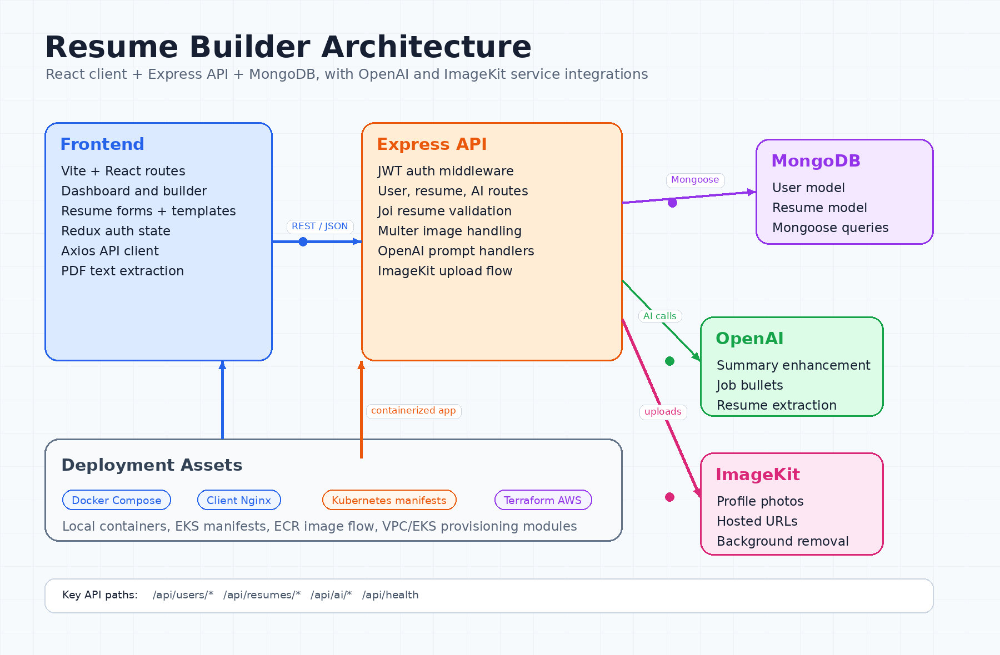

# Resume Builder

A full-stack resume builder for creating, importing, editing, previewing, and sharing professional resumes. The app includes authenticated resume management, multiple templates, AI-assisted content enhancement, PDF resume import, profile image uploads, Docker support, and Kubernetes/Terraform deployment assets.



## Features

- **Resume editor** with personal info, summary, skills, experience, projects, education, color, and template controls.
- **Multiple templates** including classic, modern, minimal, and minimal image layouts.
- **AI assistance** for enhancing professional summaries and job descriptions.
- **PDF import** that extracts resume text on the client and sends it for AI-powered structured parsing.
- **Authenticated dashboard** for creating, editing, deleting, and listing user resumes.
- **Public preview links** for resumes marked as public.
- **Image uploads** through ImageKit, including optional background removal support.
- **Deployment-ready assets** for Docker Compose, Kubernetes, EKS, ECR, and Terraform-managed AWS infrastructure.

## Architecture

The app is split into a Vite/React client, an Express API server, MongoDB persistence, and external AI/image services.

| Layer | Responsibility |
| --- | --- |
| `client/` | React UI, routing, Redux auth state, resume forms, previews, templates, PDF text extraction, and API calls. |
| `server/` | Express routes, JWT auth middleware, validation, resume CRUD, AI enhancement, resume parsing, and ImageKit uploads. |
| MongoDB | Stores users and resumes through Mongoose models. |
| OpenAI | Enhances resume content and extracts structured data from uploaded resume text. |
| ImageKit | Stores hosted profile images used in resume templates. |
| `infra/` | Kubernetes manifests and Terraform modules for AWS VPC, EKS, and ECR deployment. |

## Tech Stack

### Frontend

- React 19
- Vite 7
- React Router 7
- Redux Toolkit
- Tailwind CSS 4
- Axios
- React Hook Form
- React PDFToText
- Lucide React
- React Hot Toast

### Backend

- Node.js
- Express 5
- MongoDB with Mongoose
- JWT authentication
- Bcrypt password hashing
- OpenAI SDK
- ImageKit SDK
- Multer uploads
- Express Joi Validation

### DevOps

- Docker and Docker Compose
- Nginx for the production client container
- Kubernetes manifests under `infra/K8s/`
- Terraform AWS infrastructure under `infra/terraform/`

## Project Structure

```text
resume-builder/
├── client/
│   ├── src/
│   │   ├── app/                 # Redux store and auth slice
│   │   ├── components/          # Forms, template selector, preview, home sections
│   │   ├── components/templates # Resume template components
│   │   ├── configs/             # Axios API client
│   │   ├── pages/               # Home, dashboard, builder, preview, login layout
│   │   ├── App.jsx              # Route definitions
│   │   └── main.jsx             # React entry point
│   ├── Dockerfile
│   ├── nginx.conf
│   └── package.json
├── server/
│   ├── config/                  # DB, OpenAI, ImageKit, and Multer setup
│   ├── controllers/             # User, resume, and AI handlers
│   ├── middleware/              # JWT auth and resume-data parsing
│   ├── models/                  # User and Resume Mongoose schemas
│   ├── routes/                  # API route modules
│   ├── validations/             # Resume request validation schemas
│   ├── Dockerfile
│   └── server.js                # Express app entry point
├── infra/
│   ├── K8s/                     # Kubernetes and EKS deployment manifests
│   └── terraform/               # AWS VPC, EKS, and ECR modules
├── scripts/                     # Cluster setup and audit helpers
├── docs/                        # Extra architecture notes/assets
├── docker-compose.yml
├── resume_architecture.png
└── README.md
```

## Prerequisites

- Node.js 20+ recommended
- npm
- MongoDB connection string
- OpenAI API key
- ImageKit account credentials
- Docker and Docker Compose, optional for containerized local runs
- AWS CLI, Terraform, kubectl, and Docker for EKS deployment

## Environment Variables

Create environment files before running the app locally.

### `server/.env`

```env
PORT=3000
NODE_ENV=development
MONGO_DB_URI=mongodb://localhost:27017
JWT_SECRET=replace-with-a-strong-secret
OPENAI_API_KEY=replace-with-your-openai-key
OPENAI_MODEL=gpt-4o-mini
IMAGEKIT_PUBLIC_KEY=replace-with-imagekit-public-key
IMAGEKIT_PRIVATE_KEY=replace-with-imagekit-private-key
IMAGEKIT_URL_ENDPOINT=https://ik.imagekit.io/your-account
ALLOWED_ORIGINS=http://localhost:5173,http://localhost:3000
```

### `client/.env`

```env
VITE_BASE_URL=http://localhost:3000
```

For Docker Compose, keep shared values in a root `.env` file because `docker-compose.yml` reads them from the project root.

## Local Development

Install dependencies in each app:

```bash
cd server
npm install

cd ../client
npm install
```

Start the backend:

```bash
cd server
npm run server
```

Start the frontend in another terminal:

```bash
cd client
npm run dev
```

Development URLs:

- Client: `http://localhost:5173`
- API: `http://localhost:3000`
- Health check: `http://localhost:3000/api/health`

## Docker Compose

Run both containers from the repository root:

```bash
docker-compose up --build
```

Docker Compose exposes:

- Client: `http://localhost`
- Server: `http://localhost:3000`

Stop containers:

```bash
docker-compose down
```

## API Routes

### Users

| Method | Route | Auth | Description |
| --- | --- | --- | --- |
| `POST` | `/api/users/register` | No | Register a user and return a JWT. |
| `POST` | `/api/users/login` | No | Login and return a JWT. |
| `GET` | `/api/users/data` | Yes | Get the current authenticated user. |
| `GET` | `/api/users/resumes` | Yes | List resumes for the current user. |

### Resumes

| Method | Route | Auth | Description |
| --- | --- | --- | --- |
| `POST` | `/api/resumes/create` | Yes | Create a new resume shell. |
| `GET` | `/api/resumes/get/:resumeId` | Yes | Get one owned resume. |
| `GET` | `/api/resumes/public/:resumeId` | No | Get one public resume. |
| `PUT` | `/api/resumes/update` | Yes | Update resume data and optionally upload an image. |
| `DELETE` | `/api/resumes/delete/:resumeId` | Yes | Delete one owned resume. |

### AI

| Method | Route | Auth | Description |
| --- | --- | --- | --- |
| `POST` | `/api/ai/enhance-pro-sum` | Yes | Improve a professional summary. |
| `POST` | `/api/ai/enhance-job-desc` | Yes | Improve job description bullets. |
| `POST` | `/api/ai/upload-resume` | Yes | Convert extracted resume text into structured resume data. |

## Available Scripts

### Client

```bash
npm run dev
npm run build
npm run lint
npm run preview
```

### Server

```bash
npm start
npm run server
```

The server `test` script is currently a placeholder and exits with an error.

## Deployment

### Kubernetes

Kubernetes manifests live in `infra/K8s/`. A typical apply flow is:

```bash
kubectl apply -f infra/K8s/namespace.yml
kubectl apply -f infra/K8s/configmap.yml
kubectl apply -f infra/K8s/secrets.yml
kubectl apply -f infra/K8s/server.yml
kubectl apply -f infra/K8s/client.yml
kubectl apply -f infra/K8s/ingress.yml
kubectl apply -f infra/K8s/hpa.yml
```

See `infra/K8s/README.md` for the EKS deployment walkthrough.

### Terraform

Terraform modules live in `infra/terraform/` and provision AWS infrastructure such as VPC, EKS, and ECR:

```bash
cd infra/terraform
terraform init
terraform plan
terraform apply
```

## Troubleshooting

- **MongoDB connection fails:** confirm `MONGO_DB_URI` is set; the server appends the `resume-builder-cluster` database name when connecting.
- **AI routes fail:** confirm both `OPENAI_API_KEY` and `OPENAI_MODEL` are configured.
- **Image upload fails:** confirm all ImageKit environment variables are valid and restart the server after changing them.
- **CORS blocks requests:** add the client origin to `ALLOWED_ORIGINS`.
- **Docker frontend cannot reach API:** ensure `VITE_BASE_URL` matches the API path expected by the deployed Nginx/API setup.

## License

This project uses the ISC license from `server/package.json`.
